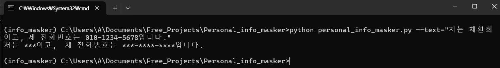
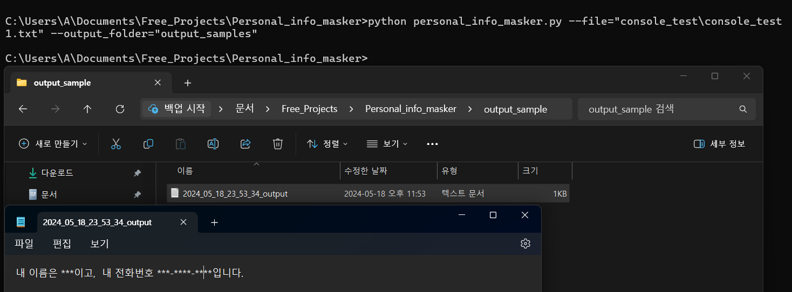

# 🪪개인 정보 마스커
<a href="./README_eng.md"></img> READ ENGLISH VERSION</a>
&nbsp;
<a href="./README_es.md"></img> Ver Versión en Español</a><br /><br />
사람들의 개인 정보를 보호하기 위해서 정규 표현을 이용하는 프로그램이다.
## ⬇️ 다운로드 리포지토리
```
git clone https://github.com/youngdo1990/personal_info_masker.git
```
## 🏞️ 가상 환경 설정
```
mkvirtualenv info_masker
cd personal_info_masker
pip install -r requirements.txt
```
## 📄 한국인 이름 리스트 만드는 과정
전화번호, 이메일, 주소는 정규 표현식으로 추출할 수 있는데 사람 이름 겨우에는 쉽게 구현할 수 있는 정규 표현식이 없다. 그 때문에 이름, 성 리스트를 만들 수 밖에 없다.<br />
이름 리스트 만들기 위해서 웹 크롤링으로 이름과 성 리스트를 생성했다.<br /><br />
<b>이름 리스트 출처:</b> <br />
<a href="https://www.name-ranking.com/ranking#from=2008&to=2024&p=577">https://www.name-ranking.com/ranking#from=2008&to=2024&p=577</a></br>
<b>성 리스트 출처:</b> <br />
<a href="https://namu.wiki/w/%ED%95%9C%EA%B5%AD%EC%9D%98%20%EC%84%B1%EC%94%A8%EB%B3%84%20%EC%9D%B8%EA%B5%AC%20%EB%B6%84%ED%8F%AC">https://namu.wiki/w/%ED%95%9C%EA%B5%AD%EC%9D%98%20%EC%84%B1%EC%94%A8%EB%B3%84%20%EC%9D%B8%EA%B5%AC%20%EB%B6%84%ED%8F%AC</a>.
### 📋 이름, 성씨 리스트 및 정규 표현식 생성
한국 성씨와 이름 리스트를 만들기 위해서 <b>korean_name_crawler.py</b> 스크립트를 실행하면 된다.
```
cd utils
python korean_name_crawler.py
```
### 🔣 한국 이름 정규 표현식 생성
한국 성씨와 이름 리스트를 만든 후 파이썬 정규 표현식을 생성해야 한다. 한국 이름 정규 표현삭울 먼둘가 위해서 크롤링된 한국 성 씨와 이름을 조합하고 정규 표현식으로 바꿔야 했다. 추출한 한국 이름 정규 표현식을 만들기 위해서 <b>korean_name_regex_generator.py</b> 스크립트를 실행하면 된다.
```
python korean_name_regex_generator.py
```
스크립트를 실행하면 <b>korname_regex.txt</b> 파일 생성한다. <b>personal_info_masker.py</b> 스크립은 <b>korname_regex.txt</b> 파일을 적재하고 한국 이름을 추출할 수 있는 정규 표현식으로 이용한다. <b>korname_regex.txt</b> 파일은 다음과 보인다.<br /><br />
</img><br />
## ⚗️ 테스팅
개인 정보 마스커를 테스팅하기 위해서 ChatGPT로 가짜 정보를 이용하는 자기소개 50개를 생성했다. OpenAI API Key 없어서 ChatGPT가 생성한 자기소개를 복사하고 텍스트 파일에 저장했다. 파일 이름은 <b>chatgpt_generated_introduction.txt</b>이며 다음과 보인다.<br /><br />
</img><br />
자기소개 내용만 필요해서 '안녕하세요!', 사인과 '감사합니다'를 담고 있는 라인을 제거하고 샘플 파일을 생성하기 위해서 <b>./utils/sample_maker.py</b> 스크립트를 실행한다.<br />
```
cd utils
python sample_maker.py
```
스크립트를 실행하면 sample1.txt부터 sample50.txt까지 담은 폴더를 생성한다. 샘플 파일은 다음과 보인다.<br /><br />
</img><br />
마지막으로 마스킹 테스팅하기 위해서 "test.py" 스크립트를 실행한다.<br /><br />
```
python test.py
```
"test.py" 스크립트는 샘플 파일 텍스트 적재하고 마스크를 한 다음에 <b>./utils/output</b> 폴더에 마스크된 텍스트를 저장한다. 마스크 된 파일 예시는 <b>./utils/outputs/sample47.txt</b>이고, 다음과 보인다.<br /><br />
<br />
## ▶️ 명령 프롬프트로 실행 방법
### 🔡 텍스트
텍스트 안에 있는 개인 정보를 마스크하고 싶으면 <b>personal_info_masker.py</b> 스크립트를 실행하고 --text 파라미터로 원하는 문자열을 전달하면 된다.<br />
❗<b>스크림을 실행하기 전에 가상 환경을 활성화해야 한다.</b>

```
python personal_info_masker.py --text=<원하는 텍스트>
```
<b>예시:</b>
```
python personal_info_masker.py --text="제 이름은 채환희이고, 제 전화번호는 010-123-5678 입니다."
```
예시 출력은 다음과 같다.<br /><br />
<br />
### 📝 파일
파일 하나만 마스크하고 싶으면 <b>personal_info_masker.py</b> 스크립트를 실행하고 --file 파라미터로 원하는 파일 경로을 전달하면 된다.<br />
❗<b>스크림을 실행하기 전에 가상 환경을 활성화해야 한다.</b>
```
python personal_info_masker.py --text=<원하는 파일 경로> --output_folder=<원하는 폴더 경로>
```
--output_folder 파라미터 지정하면 폴더 만들어 주고 거기서 마스크된 텍스트 파일을 저장한다. 파일 이름 양식은 <b><datetime>_output.txt</b>이다. 지정 안하면 출력은 명령 프롶트에 나온다.
<b>예시 1:</b>
```
python personal_info_masker.py --file="console_test\console_test1.txt"
```
<br />
<b>예시 2:</b>
<br />
```
python personal_info_masker.py --file="console_test\console_test1.txt" --output_folder="output_sample"
```
### 📁 폴더
