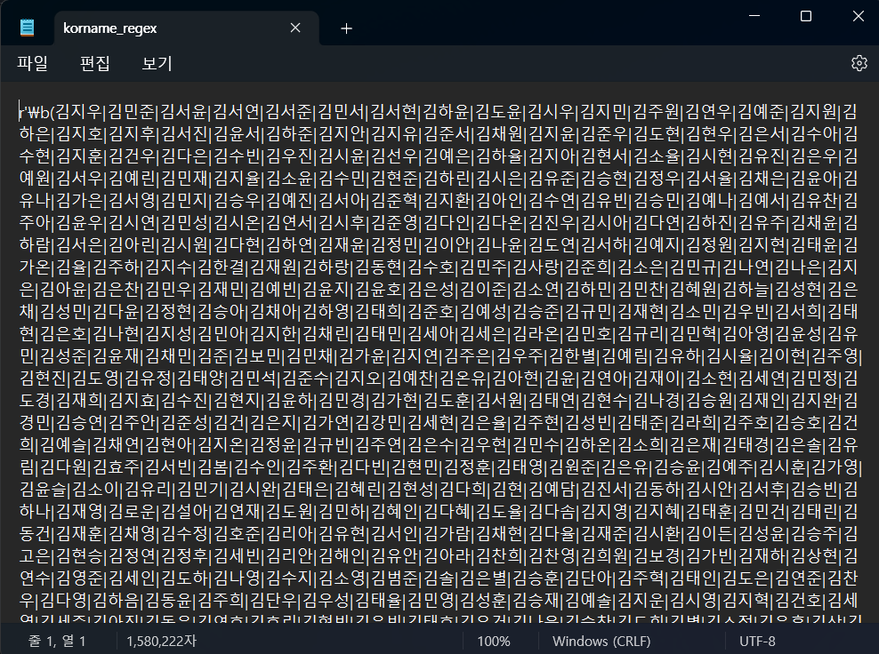

# 👮Personal Info Masker
<a href="./README.md"></img> 한국어 버전 보기</a>&nbsp;
<a href="./README_es.md"></img> Ver Versión en Español</a>
<br /><br />
This is a program which uses regular expressions to mask and protect people's personal information.
## ⬇️ Download Repository
```
git clone https://github.com/youngdo1990/personal_info_masker.git
```
## 🏞️ Virtual Environment
```
mkvirtualenv info_masker
cd personal_info_masker
pip install -r requirements.txt
```
## 📄 Make korean names list
It is possible to extract phone numbers and emails with regular expressions, but in the case of names it's difficult to make a regular expression. In order to extract names it's neccesary to make a list of names and lasta names.<br />
The names and last names list was made by web scrapping.<br /><br />
<b>Names list resource:</b> <br />
<a href="https://www.name-ranking.com/ranking#from=2008&to=2024&p=577">https://www.name-ranking.com/ranking#from=2008&to=2024&p=577</a></br>
<b>Last names list resource:</b> <br />
<a href="https://namu.wiki/w/%ED%95%9C%EA%B5%AD%EC%9D%98%20%EC%84%B1%EC%94%A8%EB%B3%84%20%EC%9D%B8%EA%B5%AC%20%EB%B6%84%ED%8F%AC">https://namu.wiki/w/%ED%95%9C%EA%B5%AD%EC%9D%98%20%EC%84%B1%EC%94%A8%EB%B3%84%20%EC%9D%B8%EA%B5%AC%20%EB%B6%84%ED%8F%AC</a>.
### 📋 Names, Last Names List Generation
<b>korean_name_crawler.py</b> script is used to make names and last names list.
```
cd utils
python korean_name_crawler.py
```
### 🔣 Korean Names Regular Expression Generationry
After making the lists of korean names and last names it's neccesary to create the regular expression. For create the regular expresion all last names are names were combinated and written in regular expression format. For generate regular espression for names you have to run <b>korean_name_regex_generator.py</b> script.
```
python korean_name_regex_generator.py
```
The script generates <b>korname_regex.txt</b>. <b>personal_info_masker.py</b> loads <b>korname_regex.txt</b> and uses it as korean name regular expression. <b>korname_regex.txt</b> looks like the image below.<br /><br />
</img><br />
## ⚗️ Testing
For testing the personal information masker 50 samples of korean introduction were generated by ChatGPT. As I don't have OpenAI API Key, I just copy and paste the samples in a text file. The file name is <b>chatgpt_generated_introduction.txt</b> and it looks like the image below.<br /><br />
</img><br /><br />
As we only need the content of introduction we removed the lines containing '안녕하세요!', '감사합니다.' and signature. That lines were removed with the script <b>./utils/sample_maker.py</b>.<br />
```
cd utils
python sample_maker.py
```
Script generates a folder which contains files from samples1.txt to samples50.txt and looks like in the image below.<br /><br />
</img><br />
Finally, for mask the samples you have to run <b>test.py</b>.<br /><br />
```
python test.py
```
The script <b>"test.py"</b> loads the sample files and after masking personal information save the masked files in <b>./utils/output</b>. One example of masked output. File name is <b>./utils/outputs/sample47.txt</b> and it looks like in the image.<br /><br />
<br />
