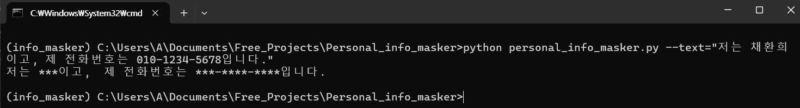
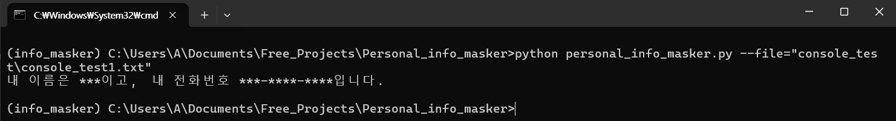
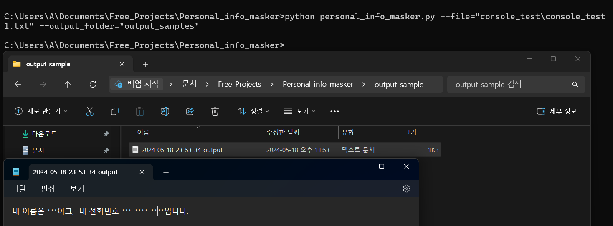

# 🪪 Enmascarador de Información Personal
<a href="./README_eng.md"></img> READ ENGLISH VERSION</a>
&nbsp;
<a href="./README_eng.md"></img> 한국어 버전 보기</a><br /><br />
Este es un programa que utiliza expresiones regulares para proteger la información personal de las personas.
## ⬇️ Descarga del Repositorio
```
git clone https://github.com/youngdo1990/personal_info_masker.git
```
## 🏞️ Creación del Entorno Virtual
```
mkvirtualenv info_masker
cd personal_info_masker
pip install -r requirements.txt
```
## 📄 Creación de una Lista de Nombres y Apellidos Coreanos
Aunque se puede crear una expresión regular para los teléfonos, emails y direcciones, es muy difícil crear una para los nombres de las personas. Por ese motivo, es necesario crear una lista de nombres y apellidos.<br />
La creación de la lista de nombres y apellidos se realiza mediante web scraping.<br /><br />
<b>Fuente de los nombres:</b> <br />
<a href="https://www.name-ranking.com/ranking#from=2008&to=2024&p=577">https://www.name-ranking.com/ranking#from=2008&to=2024&p=577</a></br>
<b>Fuente de los Apellidos:</b> <br />
<a href="https://namu.wiki/w/%ED%95%9C%EA%B5%AD%EC%9D%98%20%EC%84%B1%EC%94%A8%EB%B3%84%20%EC%9D%B8%EA%B5%AC%20%EB%B6%84%ED%8F%AC">https://namu.wiki/w/%ED%95%9C%EA%B5%AD%EC%9D%98%20%EC%84%B1%EC%94%A8%EB%B3%84%20%EC%9D%B8%EA%B5%AC%20%EB%B6%84%ED%8F%AC</a>.
### 📋 Generación de una Lista de Nombres y Apellidos
Para generar una lista de nombres y apellidos se debe utilizar el script <b>korean_name_crawler.py</b>.
```
cd utils
python korean_name_crawler.py
```
### 🔣 Generación de una Expresión Regular para Nombres Coreanos
Después de crear una lista de apellidos y nombres coreanos, se debe generar una expresión regular en Python. Para la generación de la expresión regular de nombres coreanos, fue necesario combinar y convertir los apellidos y nombres coreanos obtenidos mediante web scraping en una expresión regular. Para crear la expresión regular de nombres coreanos extraídos, simplemente ejecuta el script korean_name_regex_generator.py.
```
python korean_name_regex_generator.py
```
Al ejecutar el script se creará el archivo <b>korname_regex.txt</b>. El script <b>personal_info_masker.py</b> utilizará el archivo <b>korname_regex.txt</b> como una expresión regular para encontrar los nombres coreanos.<br /><br />
</img><br />
## ⚗️ Testing
Para probar el enmascarador de información personal, generé con ChatGPT 50 ejemplos de presentaciones personales en coreano. Como no tengo la API Key de OpenAI, simplemente pedí a ChatGPT que generara los 50 ejemplos con información personal falsa. Luego, copié y guardé los ejemplos en el archivo <b>chatgpt_generated_introduction.txt</b>, que se ve como se muestra en la imagen a continuación.<br /><br />
</img><br />
Como solo se necesita el contenido de la presentacion personal, se eliminan los token innecesarios como '안녕하세요!', '감사합니다' y la firma. Para realizar este proceso se debe correr el script <b>./utils/sample_maker.py</b>.<br />
```
cd utils
python sample_maker.py
```
Al correr el script se generan los archivos desde sample1.txt hasta sample50.txt. La imagen a continuación es un ejemplo de un archivo de ejemplo.<br /><br />
</img><br />
Finalmente para probar el enmascarador se debe correr el script "test.py".<br /><br />
```
python test.py
```
El script "test.py" carga los ejemplos y después de enmascarar la información personal, los guarda en la carpeta <b>./utils/output</b>. Un ejemplo de un archivo con texto enmascarado es el archivo <b>./utils/outputs/sample47.txt</b> y se ve como se muestra en la imagen a continuación.
<br />
## ▶️ Ejecutar en Ventana de Comandos
### 🔡 Texto
Si quiere enmascarar la información personal de un texto, ejecute el script <b>personal_info_masker.py</b> e introduzca el texto deseado usando el parámetro --text.<br />
❗<b>Antes de ejecutar el script se debe activar el entorno virtual.</b>

```
python personal_info_masker.py --text=<원하는 텍스트>
```
<b>예시:</b>
```
python personal_info_masker.py --text="제 이름은 채환희이고, 제 전화번호는 010-123-5678 입니다."
```
예시 출력은 다음과 같다.<br /><br />
<br />
### 📝 Archivo
파일 하나만 마스크하고 싶으면 <b>personal_info_masker.py</b> 스크립트를 실행하고 --file 파라미터로 원하는 파일 경로을 전달하면 된다.<br />
❗<b>스크림을 실행하기 전에 가상 환경을 활성화해야 한다.</b>
```
python personal_info_masker.py --text=<원하는 파일 경로> --output_folder=<원하는 폴더 경로>
```
--output_folder 파라미터 지정하면 폴더 만들어 주고 거기서 마스크된 텍스트 파일을 저장한다. 파일 이름 양식은 <b>'datetime'_output.txt</b>이다. 지정 안하면 출력은 명령 프롶트에 나온다.<br />
<b>예시 1 (콘솔 출력):</b>
```
python personal_info_masker.py --file="console_test\console_test1.txt"
```
<br />
<b>예시 2 (파일 출력):</b>
<br />
```
python personal_info_masker.py --file="console_test\console_test1.txt" --output_folder="output_sample"
```
### 📁 Carpeta
